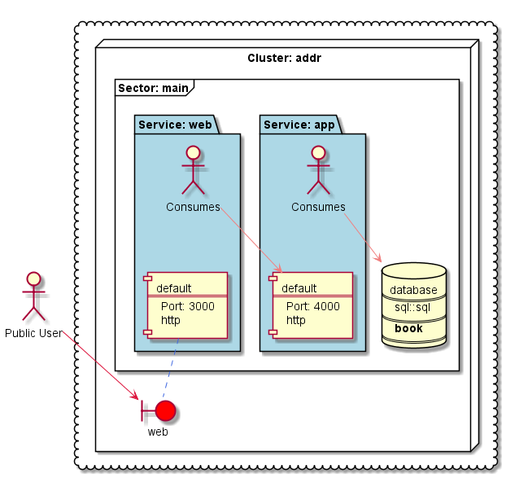

# Berlioz Benchmark
## Address Book App - Traditional Method

This is a simple 3-tiered web app.

Purpose of this repo is to compare development as well as  deployment processes using traditional methods vs using Berlioz.

### Deployment Stack
We are going to deploy the app to Google Cloud Platform. We will make use of:
- Terraform
- Ansible
- CircleCI 

### App Directory Structure
**/web** - the web front end. Implemented using node.js. Dockerized. Talks to **app**.

**/app** - the back end. Implemented using node.js. Dockerized. Communicates with the database.

**/book** - the MySQL 5.7 database. Contains an **init.sql** to initialize the database.

### Running Locally
We need a single script *"run-local.sh"* to bring up the entire application locally on the computer. 
Once the script is execute the application should be up and running, database - initialized.
Should also allow incremental changes to the code to be applied.

### Running In The Cloud
We need a single script *"run-local.sh"* to deploy the entire application in the cloud. 
Should deploy to a blank GCP Project. Should also allow incremental changes to the code
to be applied.

### CI/CD
The CI/CD pipeline is implemented using CircleCI. 